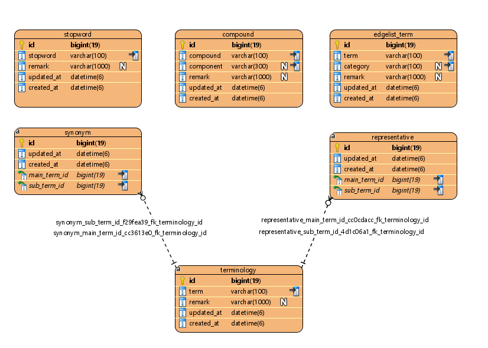

# Euclid-Data-platform
<!-- START doctoc generated TOC please keep comment here to allow auto update -->
<!-- DON'T EDIT THIS SECTION, INSTEAD RE-RUN doctoc TO UPDATE -->
**Table of Contents**

- [About the Project](#about-the-project)
- [Requirements](#requirements)
- [Getting Started](#getting-started)
- [Usage](#usage)
- [About Elasticsearch index schema](#about-elasticsearch-index-schema)
- [Roadmap](#roadmap)
- [License](#license)
- [Contact](#contact)

<!-- END doctoc generated TOC please keep comment here to allow auto update -->


## About the Project
- Full-text search 및 문서키-단어-단어빈도 기반 문서 텍스트 분석 프레임워크
- [프로젝트 폴더 구조](./euclid-data-platform/docs/project_app_structure.md)

## Requirements

|                               |      version (dev)        |
| ----------------------------- | ------------------------- |
| Python                        | 3.9.5                     |
| Elasticsearch(Server)         | 7.13.1                    |
| elasticsearch(python-clinet)  | 7.13.1                    |
| MySQL                         | 8                         |
| Django                        | 3.2                       |
| djangorestframework           | 3.12.4                    |
| python-igraph                 | 0.9.6                     |
**Note: MySQL 8 버전에서만 테스트 되었음**


## Getting Started
- Elasticsearch 는 이미 설치되어있다고 가정
- django framework 프로젝트 구조 및 backend(데이터베이스) 설정에 대한 이해가 있다고 가정
### initial setting
- DATABASES 정의
    - default, auth_db, docu_데이터베이스명의 형태로 필요 값 설정
    - 자료구조는 변동하지 말아야함 (dict 형태 값은 dict로, list 형태의 값은 list 형태 유지)
    - 아래 상세 설명 참조
```python
DATABASES = {
    # default는 {} 로 유지 (database router 사용위해 default 값 없음)
    'default': {},
    # django 관련 메타 데이터 저장 데이터베이스, key값 auth_db 로 유지
    'auth_db':{
        'NAME': 'auth_db',
        'ENGINE': 'django.db.backends.mysql',
        'USER': 'TEMP_USER',
        'PASSWORD': 'TEMP_PASSWORD',
        'HOST': 'MYSQL_HOST',
        'PORT': 'MYSQL_PORT',
        'CHARSET': 'MYSQL_CHARSET',
    },
    # 분석 대상 문서 데이터베이스. key값에 'docu_' 라는 prefix 유지. 
    # 내부적으로 docu_ 로 시작되는 데이터베이스는 분석대상 문서로 취급
    # ex) 특허 관련 문서들 => docu_patent
    'docu_test': {
        'NAME': 'docu_test',
        # mysql engine에서만 테스트되어 있음
        'ENGINE': 'django.db.backends.mysql',
        'USER': TEMP_USER,
        'PASSWORD': TEMP_PASSWORD,
        'HOST': MYSQL_HOST,
        'PORT': MYSQL_PORT,
        'CHARSET': MYSQL_CHARSET,
        # 설치된 Elasticsearch 관련 정보
        'ELASTICSEARCH_INFO': {
            # 생성될 index의 alias 이름
            'INDEX_NAME': 'docu_test',
            # index 생성 시 사용할 settings, mappings 정보 템플릿
            'INDEX_TEMPLATE_PATH': 'config.resources.elasticsearch_index_template',
            # 섹션의 개수만큼 shard 생성 (나누어진 shard 별로 문서 빈도 집계가 이루어짐)
            'NUMBER_OF_SECTION': 10,
            'HOST': TEMP_ELASTICSEARCH_HOST,
            'PORT': TEMP_ELASTICSEARCH_PORT,
            'USER': TEMP_ELASTICSEARCH_USER,
            'PASSWORD': TEMP_ELASTICSEARCH_PASS,
            # 엘라스틱서치가 설치된 호스트 머신의 SSH 접속정보
            # 인덱싱 시 사용할 사용자사전을 SSH 접속 통해 생성함
            # 엘라스틱서치를 클러스터로 구성하여 여러대의 머신이 있을 경우, 클러스터에 포함된 머신 정보 모두 입력
            'CLUSTER_SERVER_INFO': [
                {
                    'SSH_IP': '192.168.x.x',
                    'SSH_PORT': 22,
                    # 엘라스틱서치가 설치된 머신에서 $ES_HOME 폴더 경로
                    # config 폴더 상위경로로 지정 (사용자사전 파일 복사 위치 기준점으로 삼음)
                    'ELASTICSEARCH_HOME': '/data/elasticsearch-cluster/elasticsearch-7.13.1',
                    # 보안 접속일 경우 아이디 패스워드 값
                    'SSH_USER': 'elastic',
                    'SSH_PASSWORD': '',
                },
                {
                    'SSH_IP': '192.168.x.x',
                    'SSH_PORT': 22,
                    'ELASTICSEARCH_HOME': '/data/elasticsearch-cluster/elasticsearch-7.13.1',
                    'SSH_USER': 'elastic',
                    'SSH_PASSWORD': '',
                }
            ]
        },
        # 전처리된 자료가 있는 데이터베이스 접속 정보
        # 현재 마이그레이션 로직은 KEIT - ROME 프로젝트 데이터 기준으로 작성됨
        # 추가 작업 예정
        'MIGRATION_INFO': {
            'access_info': {
                'USER': TEMP_SRC_USER,
                'PASSWORD': TEMP_SRC_PASSWORD,
                'HOST': TEMP_SRC_HOST,
                'PORT': TEMP_SRC_PORT,
                'NAME':'sociocube03',
                'ENGINE': 'MYSQL',
            },
            # 전처리 자료 모음 테이블명 (테이블명 뒤에 WHERE 절 기입 가능)
            'table_name': 'PATENT LIMIT 500000,20000',
            # key값은 분석엔진에서 사용하는 컬럼값
            # 해당 key값에 매칭되는 전처리 자료 db의 컬럼을 맵핑
            # 해당되는 컬럼이 없을 시 "" 로 입력 (필수에 해당하는 컬럼 제외, 정보 없을 시 임의의 값이라도 넣어줘야함)
            'target_source_column_mapping': {
                # *문서 고유번호 (필수)
                "doc_id":"VDKVGWKEY",
                # 문서 발행국가 코드 
                "country_code":"COUNTRY_CODE",
                # *제목 (필수)
                "title":"INVENTION_TITLE_KO",
                # *내용 (필수)
                "content":"ASTRT_CONT",
                # *문서 발행/발간년도 (필수)
                # 정보 확인 안될 시 특정 값으로 입력 (ex: 0000 또는 9999)
                "publication_date":"APP_DT",
                # *문서 섹션 (필수) (1-depth 카테고리)
                # 문서 내 용어 관련 빈도 계산의 베이스
                # 섹션 정보가 없을 시 임의의 값으로 입력 (같은 섹션 값을 갖는 문서끼리 분석이 됨)
                "doc_section":"SECTION",
                # 문서 클래스 (2-depth 카테고리)
                "doc_class":"",
                # 문서 서브클래스 (3-depth 카테고리)
                "doc_subclass":"",
                # 발행인 고유번호
                "publisher_code":"APAGT_CD",
                # 발행인 이름
                "publisher_name":"APAGT_NM",
                # 비고
                "remark":"",
            }
        }
    }
}
```
- Engine DBMS 에 필요한 데이터베이스 수동 생성 (DATABASES 정의에서 설정한 NAME 값으로 물리적 데이터베이스 생성)
- 의존 라이브러리 설치
```shell
# 개발용
pip install ${DIR}/euclid-data-platform/euclid-data-platform/edap/requirements/dev.txt
# 배포용
pip install ${DIR}/euclid-data-platform/euclid-data-platform/edap/requirements/prod.txt
```
- 초기 설정 관련 script 실행
- 최초 자료 준비 순서
    1. DATABASES에 기술한 데이터베이스 연결 및 ORM 설정
    1. 전처리 완료된 문서데이터를 분석 DATABASES 로 이관
    1. 사용자 사전 생성 및 elasticsearch reindexing (새로 생성한 사용자 사전에 맞춰 단어 토크나이징 및 빈도수 체크)
    1. elasticsearch 내 토큰/빈도 기반으로 분석용 단어셋 생성
    1. 분석 준비 완료
    1. 필요에 따라 단어 추가 및 삭제 (단어의 역할 및 상관관계는 [About Dictionary Management](#about-dictionary-management) 참조)
```shell
# manage.py 위치로 이동 후 커맨드라인 입력
# 설정한 모든 데이터베이스 내 테이블 생성 및 ORM 연결
python manage.py migrate_all_db

# 전처리 완료 자료를 분석 데이터베이스로 자료 이관
python manage.py migrate_docu_data

# 용어 추출 모듈을 사용해서 초기 자료 세팅
# 초기 사용자 사전 생성 
python manage.py create_terminology_compound.py

# 분석용 단어셋 생성
python manage.py create_edgelist_term_stopword.py
```

## Usage
- 키-단어-빈도 자료를 기반으로 분석이 필요한 데이터에 활용 가능한 분석 플랫폼
- 데이터베이스 관련 정보를 DATABASES에 정의 (Depth 및 정해진 양식에 맞춰서 작성)
    - 입력 필요 항목
        - django 메타 데이터 저장 DB 접속 정보 (auth_db)
        - 문서 그룹 관련 DB 정보 (docu_*)
        - 전처리 완료된 문서 저장 DB 접속 정보 (docu_* => MIGRATION_INFO)
        - 전처리 완료된 문서 저장 DB 테이블과 분석 엔진 테이블의 컬럼 맵핑 정보 (target_source_column_mapping)
        - 엘라스틱서치 접속 정보 (ELASTICSEARCH_INFO)
        - 엘라스틱서치 설치된 호스트 머신 SSH 접속 정보 (CLUSTER_SERVER_INFO)
- 데이터 분석엔진 DB로 이관
- 사전 구성
- HTTP API 또는 CONSOLE API 통해 분석 수행

## About Dictionary Management

- 사전 구성 요소:
    - terminolgoy: 명사 등 텍스트 토크나이징 시 사용되는 용어목록
    - synonym: 동의어 (main_term, sub_term 둘중에 하나에 해당하는 단어는 나머지 단어와 같은 단어로 취급됨)
    - representative: 대표어 (sub_term에 해당하는 단어는 main_term로 대체됨)
    - stopword: 불용어 (토크나이징 및 분석에서 제외할 단어 목록)
    - compound: 복합어 (명사를 복합어형태로 사용할 필요가 있을 시 사용)
    - edgelist_term: 분석에 사용할 용어 목록

- 사전활용 정책
    - 토크나이저가 텍스트 토크나이징 시 사용하는 사용자 사전은 terminology 및 compound 로 구성됨
    - 일반적으로 많이 쓰이는 단어들은 토크나이저가 적절히 단어를 추출할 가능성이 높지만, 신조어나 특수용어의 경우 토크나이징이 적절하지 않게 될 수 있기 때문에 사용자사전을 구성해서 사용 (즉, 해당 데이터는 신조어, 특수용어 위주로 구성하는 편이 좋음)
    - 복합어(compound)의 경우, nori-tokenizer에서 복합어를 사용하도록 설정하면 인덱싱 및 검색 시 복합어 구성 단어들을 선택적으로 활용 가능
        - elasticsearch index 설정 시 tokenizer 세팅값에서 decompound_mode 값을 아래의 값으로 설정해서 사용 가능:
            - mixed: 복합어와 복합어 구성단어 모두 사용 (인공지능자율주행 => 인공지능자율주행, 인공지능, 자율주행)
            - discard: 복합어 구성단어만 사용 (인공지능자율주행 => 인공지능, 자율주행)
            - none: 복합어 구성단어 사용안함 (인공지능자율주행 => 인공지능자율주행)
    - 키워드로 문서를 검색 시 동의어와 대표어 관계를 활용해서 검색함
        - ex) 인공지능과 AI가 동의어 관계면, 인공지능 또는 AI 단어를 갖고 있는 문서들을 검색함
        - ex) 인공지능이 AI의 대표어면, AI 검색 시 인공지능으로 문서를 검색함
    - 불용어의 경우, 텍스트를 인덱싱할 때와 키워드 검색할 때 모두 적용됨
        - ex) 발명이 불용어로 등록되면, "인공위성을 발명하였다"라는 문장은 "인공위성","발명"으로 토크나이징 될 가능성이 높고, 그 중 "인공위성"만 해당 인덱싱 처리가 됨. 키워드 검색 시 "인공위성 발명" 으로 검색하면 인공위성이라는 키워드만 활용해서 문서를 검색함
    - edgelist_term은 토크나이징된 모든 단어가 아닌 중요한 단어에 대해서만 진행할 수 있도록 white-list 형태의 단어 목록. 텍스트-빈도 기반 분석 작업 시 성능과 분석 결과 품질 향상을 위해 사용함
    - edgelist_term에 추가되는 단어는 terminology에도 추가되어야 함. 토크나이징이 선행되지 않으면 edgelist_term을 적용하는 의미가 없음. (특정 단어가 텍스트에서 우선 추출되어야 해당 특정 단어를 사용할 지 말 지 판단 할 수 있음)


## About Elasticsearch index schema
- 엘라스틱서치 인덱스 스키마 구조 상세 설명
- [index-schema](./euclid-data-platform/docs/elasticsearch_index_schema.md)

## Roadmap

## License

## Contact
권영호 - yhwkon@euclidsoft.co.kr
Project Link: http://euclidai.kr:20080/data_analysis/euclid-data-platform